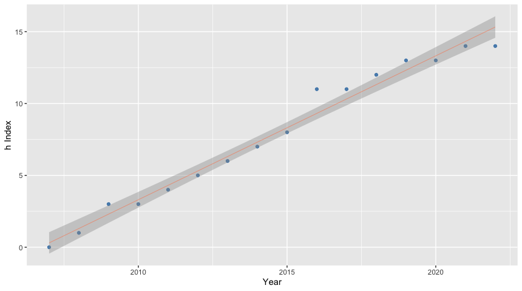

# hIndex
Get a graphical representation of the h Index over the years for a given author.

This R-package is motivated by the reading of [How does a scientist's h-index change over time?](https://jeffollerton.wordpress.com/2015/05/10/how-does-a-scientists-h-index-change-over-time/), 
by  **Jeff Ollertons**, Professor of Biodiversity in the Department of Environmental and Geographical Sciences at the University of Northampton. It is a great post and I highly recommend it.

By using the R-package you will be able to:  
  * observe how your h-index has changed over your career time  
  * compare your h-index change with others scientists'change   
  * estimate how long it takes on average to get 1 citation for your most highly accessed papers (from publication date to present). 
  
  What's new ? 
====
* **V1.5** 2022-07-26. Make a linear regression model.  
* **V1.0** 2018-09-02. Create plots using ggplot2.    
* **V0.1** 2016-02-17. First release.


### Corrections

Improvements and corrections to this document can be submitted on its [GitHub](https://github.com/jdieramon/hIndex/blob/master/tutorial.Rmd) in its [repository](https://github.com/jdieramon/hIndex).

### Data set
* Get the list of documents written by a given author and click on *View citation overview*.

  

* Set Data range. Starting year corresponds to the beginnning publication record, so that author has **h index = 0**. Then, update the system. 

  
* Export the citation overview to a spreedsheet  


***
  
### Install the hIndexOverYears from Github
**Step1**. You need to install the [devtools](https://github.com/hadley/devtools) package.

```r
install.packages("devtools")
```
<br>
**Step2**. Load the devtools package.

```r
library(devtools)
```
<br>
**Step3**. Install the **hIndexOverYears** package. 

```r
install_github("jdieramon/hIndex")
```

***
  
### Usage
Load the package

```r
library(hIndexOverYears)
```

<br>
Let´s take a look at the documentation of the package.

```r
library(help=hIndexOverYears)
```


<br>
You can see the code for the functions:

```r
?h.plot
?get1cite
```

### Tidy Data  
Before we start the analysis, we want to make the data tidy. The good thing is that Scopus keeps the same format for every citation overview, so data cleaning can be performed in one easy step. The function `clean` will read and clean the data for you.

**Load and clean data**

```r
dat <- clean("CTOExport.csv")
```

Now, the dataset is ready for further analysis.  
    
  
### Plot the h Index  
You can also use the `h.plot` function on the tidy data to show the h Index evolution over years. If the starting year does not correspond with h=0, you can enter the h value as an argument:

```r
h.plot(dat, 2007, 2018, 0)
```


<br>
You may also want to use the `get1cite`function to list your most highly cited papers (top10) and get a sense of how long it takes to get then 1 citation. 
The function shows by default your top10 cited papers, but you can give the number of papers as an argument. It shows the average time (in months) per 1 cite. 


```r
get1cite(dat)
```

```
##    Year                                     Journal avgMonth
## 1  2010                                      Planta     0.98
## 2  2011  Journal of Agricultural and Food Chemistry     2.10
## 3  2014       Environmental and Experimental Botany     2.53
## 4  2008                     Analytical Biochemistry     2.67
## 5  2013                                    PLoS ONE     3.53
## 6  2007 Physiological and Molecular Plant Pathology     3.88
## 7  2013  Journal of Agricultural and Food Chemistry     4.00
## 8  2017                                    PLoS ONE     4.00
## 9  2012                          Molecular Breeding     4.24
## 10 2011                     Analytical Biochemistry     4.42
## 11 2012              Journal of Experimental Botany     4.80
## 12 2009                               Weed Research     5.14
## 13 2013                          Molecular Breeding     5.45
## 14 2016       Environmental and Experimental Botany     8.00
## 15 2011                     Analytical Biochemistry     9.33
```


<br>

A new functionality included in v1.5 is the linear regression model. The function 
`h.model` does the job using the same arguments as before: 
```r
<<<<<<< HEAD
h.plot(dat, 2007, 2022, 0)
=======
h.model(dat, 2007, 2022, 0)
>>>>>>> 350c04bd892f69a1f1bd408c05f70a3d7aa36a30
```
ls fig  

Finally, the linear regression model can be plotted using the function `model.plot` that 
takes the same arguments. 
```r
model.plot(dat, 2007, 2022, 0)
```



  Session information

```r
sessionInfo()
```

```
## R version 3.5.0 (2018-04-23)
## Platform: x86_64-apple-darwin15.6.0 (64-bit)
## Running under: macOS High Sierra 10.13.3
## 
## Matrix products: default
## BLAS: /Library/Frameworks/R.framework/Versions/3.5/Resources/lib/libRblas.0.dylib
## LAPACK: /Library/Frameworks/R.framework/Versions/3.5/Resources/lib/libRlapack.dylib
## 
## locale:
## [1] en_US.UTF-8/en_US.UTF-8/en_US.UTF-8/C/en_US.UTF-8/en_US.UTF-8
## 
## attached base packages:
## [1] stats     graphics  grDevices utils     datasets  methods   base     
## 
## other attached packages:
## [1] bindrcpp_0.2.2      hIndexOverYears_1.0
## 
## loaded via a namespace (and not attached):
##  [1] Rcpp_0.12.18       knitr_1.20         bindr_0.1.1       
##  [4] magrittr_1.5       munsell_0.5.0      tidyselect_0.2.4  
##  [7] colorspace_1.3-2   R6_2.2.2           rlang_0.2.2       
## [10] plyr_1.8.4         stringr_1.3.1      dplyr_0.7.6       
## [13] tools_3.5.0        grid_3.5.0         gtable_0.2.0      
## [16] htmltools_0.3.6    lazyeval_0.2.1     yaml_2.2.0        
## [19] rprojroot_1.3-2    digest_0.6.15      assertthat_0.2.0  
## [22] tibble_1.4.2       crayon_1.3.4       RColorBrewer_1.1-2
## [25] purrr_0.2.5        ggplot2_3.0.0      glue_1.3.0        
## [28] evaluate_0.11      rmarkdown_1.10     stringi_1.2.4     
## [31] compiler_3.5.0     pillar_1.3.0       scales_1.0.0      
## [34] backports_1.1.2    pkgconfig_2.0.2
```

