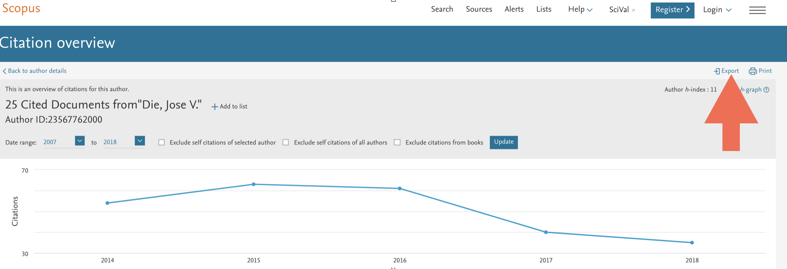

  
This is a markdown tutorial on how to use the **hIndexOverYears** package. It is based on the overview of citations from a given author. **Data have to be obtained
from [Scoups](www.scopus.com) Database**.  
<br>  
  
### Corrections

Improvements and corrections to this document can be submitted on its [GitHub](https://github.com/jdieramon/hIndex/blob/master/tutorial.Rmd) in its [repository](https://github.com/jdieramon/hIndex).

### Data set
* Get the list of documents written by a given author and click on *View citation overview*.

  

* Set the Data range. Starting year corresponds to a year, so **h index = 0 for that author**. 

  
**Note for Senior Authors**: Scopus citation overview page can display up to 16 years. If your publication history goes back <2000, you will have to use **`r as.numeric(format(Sys.Date(), "%Y"))-16`** as your starting year.  

* Export the citation overview to a spreedsheet  


***
  
### Install the hIndexOverYears from Github
**Step1**. You need to install the [devtools](https://github.com/hadley/devtools) package.
```{r eval=FALSE}
install.packages("devtools")
```
<br>
**Step2**. Load the devtools package.
```{r eval=FALSE}
library(devtools)
```
<br>
**Step3**. Install the **hIndexOverYears** package. 
```{r eval=FALSE}
install_github("jdieramon/hIndex")
```

***
  
### Usage
Load the package
```{r }
library(hIndexOverYears)
```

<br>
Let´s take a look at the documentation of the package.
```{r docum}
library(help=hIndexOverYears)
```


<br>
You can see the code for the functions:
```{r code}
?geth
?h.plot
?plot1cite
```

<br>  
Tidy Data  
Before we can work with further analysis, we want to make data tidy. The good thing is that Scopus keeps the same format for every citation overview, so data cleaning can be performed in one easy step. The function *clean()*  will read and clean the data for you.

**Load and clean data**
```{r}
dat <- clean("CTOExport.csv")
```

Now, the data set is ready to further analysis with the **hIndexOverYears** package. 
    
  
**Plot your h Index over years**  
You can use the *h.plot()* function on the tidy data to show the h Index evolution. If the starting year does not correspond with h=0, you can enter the h value as an argument:
```{r plot, eval=FALSE}
h.plot(dat, 2007, 2016, 0)
```


<br>
You also can use the *plot1cite()* function to get a sense of how long it takes to get 1 citation for your most highly cited papers. 
```{r}
plot1cite(dat)
```
 

<br>
You may want to list those publications. The output shows the Publication Year, Journal Title and the estimate of Months/1citation.
```{r}
format1cite(dat)
```
  
  Session information
```{r}
sessionInfo()
```
