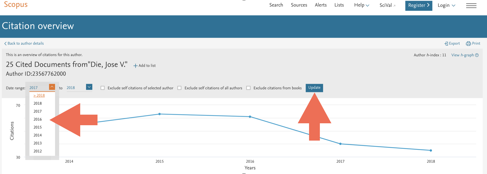
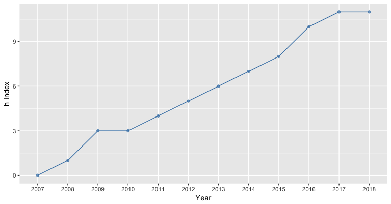

  
This is a markdown tutorial for the **hIndexOverYears** package. It is based on the overview of citations from a given author. **Data has to be obtained from [Scoups](www.scopus.com) Database**.  
<br>  
  
### Corrections

Improvements and corrections to this document can be submitted on its [GitHub](https://github.com/jdieramon/hIndex/blob/master/tutorial.Rmd) in its [repository](https://github.com/jdieramon/hIndex).

### Data set
* Get the list of documents written by a given author and click on *View citation overview*.

  

* Set Data range. Starting year corresponds to the beginnning publication record, so that author has **h index = 0**. 

  
* Export the citation overview to a spreedsheet  


***
  
### Install the hIndexOverYears from Github
**Step1**. You need to install the [devtools](https://github.com/hadley/devtools) package.
```{r eval=FALSE}
install.packages("devtools")
```
<br>
**Step2**. Load the devtools package.
```{r eval=FALSE}
library(devtools)
```
<br>
**Step3**. Install the **hIndexOverYears** package. 
```{r eval=FALSE}
install_github("jdieramon/hIndex")
```

***
  
### Usage
Load the package
```{r message = FALSE}
library(hIndexOverYears)
```

<br>
Let´s take a look at the documentation of the package.
```{r docum}
library(help=hIndexOverYears)
```


<br>
You can see the code for the functions:
```{r code}
?h.plot
?get1cite
```

### Tidy Data  
Before we start the analysis, we want to make the data tidy. The good thing is that Scopus keeps the same format for every citation overview, so data cleaning can be performed in one easy step. The function `clean` will read and clean the data for you.

**Load and clean data**
```{r}
dat <- clean("CTOExport.csv")
```

Now, the dataset is ready for further analysis.  
    
  
### Plot the h Index  
You can also use the `h.plot` function on the tidy data to show the h Index evolution over years. If the starting year does not correspond with h=0, you can enter the h value as an argument:
```{r plot, eval=FALSE}
h.plot(dat, 2007, 2018, 0)
```


<br>
You may also want to use the `get1cite`function to list your most highly cited papers (top10) and get a sense of how long it takes to get then 1 citation. 
The function shows by default your top10 cited papers, but you can give the number of papers as an argument. It shows the average time (in months) per 1 cite. 


```{r}
get1cite(dat)
```


<br>


  Session information
```{r}
sessionInfo()
```
