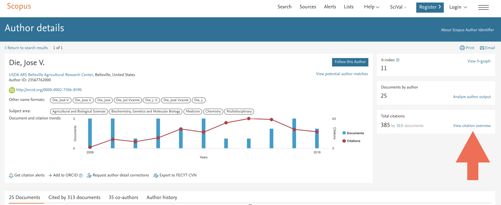
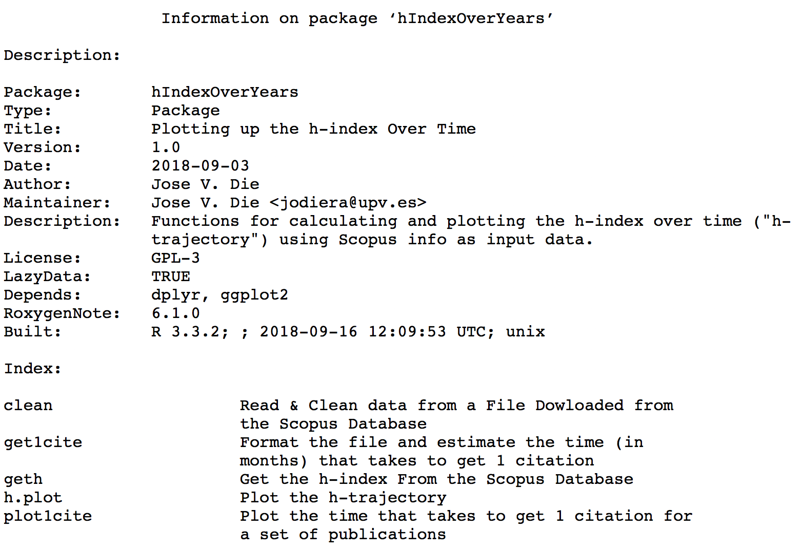

# hIndexOverYears tutorial
Jose V. Die  
February 18, 2016  
  
This is a markdown tutorial on how to use the **hIndexOverYears** package. It is based on the overview of citations from a given author. **Data have to be obtained
from [Scoups](www.scopus.com) Database**.  
<br>  
  
### Data set
1. Get the list of documents written by a given author and click on *View citation overview*.

  
<br>  
    
2. Set the Data range. Starting year corresponds to a year, so **h index = 0 for that author**. 

  
<br>  

3. Export the citation overview to a spreedsheet  


***
### Tidy Data
Before we can work with further analysis, we want to make data tidy. The good thing is that Scopus keeps the same format for every citation overview, so data cleaning can be performed in three easy steps.  

**Step1: Load data**

```r
dat <- read.csv("CTOExport.csv")
```
<br>

**Step2: Rename columns**  
Column names are found in:  
- row 6: it contains names for columns 1-7     
- row 5: it contains names for columns 8-end

```r
colnames(dat) = c(as.character(unlist(dat[6,1:7])),dat[5,8:ncol(dat)])
```
####clave: scar los elementos de una lista y luego convertirlos a character
<br>
**Step3: remove unnecessary columns and rows**  

```r
#### remove last 3 columns
dat = dat[ , 1:(ncol(dat)-3)]
#### remove column 8
dat=dat[,-8]
#### remove rows 1-6
dat = dat[-c(1:6),]
```

Now, the data set is ready to further analysis with the **hIndexOverYears** package. 
  
***
### Install the hIndexOverYears from Github
**Step1**. You need to install the [devtools](https://github.com/hadley/devtools) package.

```r
install.packages("devtools")
```
<br>
**Step2**. Load the devtools package.

```r
library(devtools)
```
<br>
**Step3**. Install the **hIndexOverYears** package. 

```r
install_github("jdieramon/hIndex")
```

***
### Working with the hIndexOverYears package
Load the package

```r
library(hIndexOverYears)
```

<br>
Let´s take a look at the documentation of the package.

```r
library(help=hIndexOverYears)
```


<br>
You can see the code for the functions:

```r
?geth
?h.plot
```

<br>
You can use the *h.plot* function on the tidy data to show the h Index evolution (from year with h=0 to the current year):

```r
h.plot(dat, 2007, 2016)
```

